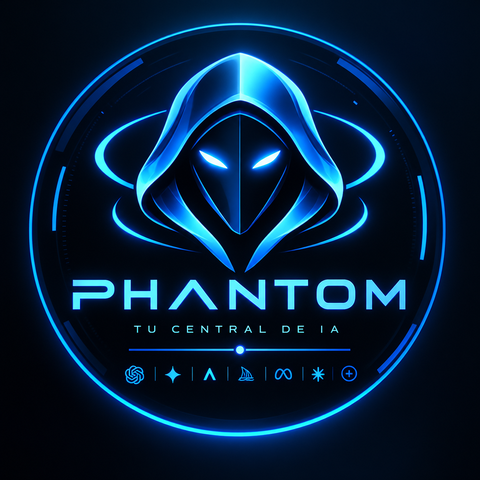
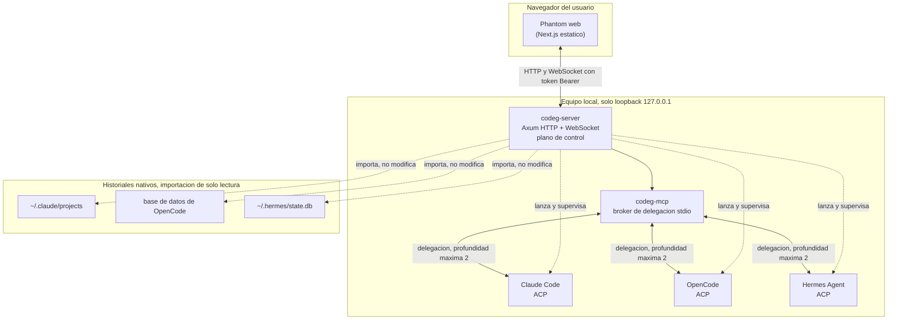

<p align="center">
  
</p>

# Phantom


Interfaz local unificada para **OpenCode**, **Claude Code** y **Hermes Agent**: una sola línea temporal, un solo selector de agente/modelo y delegación entre los tres mediante menciones `@Agente`.

Esta capa es un envoltorio ligero. Toda la implementación reutiliza [Codeg](https://github.com/xintaofei/codeg), licenciado bajo Apache-2.0, en lugar de duplicar su cliente ACP, streaming, permisos, terminal, diffs, Git/worktrees e importador de conversaciones. `codeg` se conserva como nombre interno en APIs, rutas, MCP y almacenamiento por compatibilidad; el nombre visible del producto es **Phantom**.

## Arquitectura



`codeg-server` mantiene la vista unificada, el estado de streaming/permisos y sirve la UI estática. `codeg-mcp` es el broker de delegación local: no es un modelo, solo enruta una tarea a un agente y devuelve el resultado. Cada agente conserva su propio proceso, contexto, credenciales e historial nativo; no hay un agente maestro permanente. Detalle completo de la decisión y sus consecuencias en [`ARCHITECTURE.md`](ARCHITECTURE.md), la política de igualdad entre agentes en [`AGENTS.md`](AGENTS.md), y el flujo de trabajo paralelo/worktrees en [`PARALLEL-WORKFLOW.md`](PARALLEL-WORKFLOW.md).

## Instalación local (Linux, Fedora + KDE Plasma)

### Prerrequisitos

- Toolchain de Rust (estable, vía `rustup`; el crate usa `edition = "2021"`).
- `pkg-config` y las cabeceras de OpenSSL (`sudo dnf install pkg-config openssl-devel` en Fedora; `libssl-dev` en Debian/Ubuntu): el servidor enlaza `openssl-sys`.
- Node.js 22 o superior (probado con 22; la imagen Docker usa 24) y `pnpm` (el repo fija `pnpm@11.9.0` vía `packageManager`/`corepack`).
- Los CLI de los agentes que se vayan a usar (`claude`, `opencode`, Hermes) ya instalados y autenticados por su cuenta.
- `systemd` de usuario (el servicio `codeg.service` corre como unidad `--user`).
- `curl`, `jq` y `python3` para los scripts de diagnóstico.

### Disposición de directorios

```text
phantom/                     # este repo (wrapper): docs, scripts, bin, integrations/
└── codeg/                   # submódulo git: fork de Codeg (Apache-2.0), rama local/opencode-v2-history
```

```bash
git clone --recurse-submodules https://github.com/Julian-Rincon/phantom.git
cd phantom
# si ya estaba clonado sin submódulos:
git submodule update --init
```

### Configuración

1. Generar el token de acceso y crear la configuración privada del servidor a partir de la plantilla:

   ```bash
   mkdir -p ~/.config/codeg
   cp .env.example ~/.config/codeg/server.env
   sed -i "s/^CODEG_TOKEN=.*/CODEG_TOKEN=$(openssl rand -hex 32)/" ~/.config/codeg/server.env
   chmod 600 ~/.config/codeg/server.env
   ```

2. Revisar `~/.config/codeg/server.env` y completar `CODEG_DATA_DIR`/`CODEG_STATIC_DIR` si no se usan los valores por defecto (`~/.local/share/codeg` y `~/.local/share/codeg/web`).

### Compilación e instalación

Ejecutar los scripts en orden:

```bash
# 1. Verificación: rustfmt, cargo check, tests del parser y de la librería del servidor
./scripts/build-codeg-local.sh

# 2. Build de release e instalación de los binarios en ~/.local/bin (reinicia el servicio)
./scripts/install-local-build.sh

# 3. Build de la UI (pnpm) y despliegue del export estático a ~/.local/share/codeg/web
./scripts/install-phantom-ui-web.sh

# 4. Integración con KDE Plasma: launcher, notificaciones, icono y límites de recursos del servicio
./scripts/install-plasma-integration.sh
```

En la primera ejecución `install-local-build.sh` instala y habilita la unidad de usuario [`integrations/systemd/codeg.service`](integrations/systemd/codeg.service) (arranca con la sesión, `UMask=0077`, lee `~/.config/codeg/server.env`). Después detiene `codeg.service`, respalda el binario anterior (`*.backup-<fecha>`) y reinicia el servicio al terminar, incluso si el build falla a mitad de camino. `install-phantom-ui-web.sh` respalda el directorio estático previo de la misma forma.

### Abrir la interfaz

```bash
./bin/open-codeg.sh          # inicia el servicio si hace falta y abre http://127.0.0.1:3080 en ventana propia
./bin/codeg-status.sh        # estado del servicio, salud, delegación y conteo de historial, sin imprimir el token
```

En el primer inicio, pegar en el login de Codeg el valor de `CODEG_TOKEN` con:

```bash
sed -n 's/^CODEG_TOKEN=//p' ~/.config/codeg/server.env
```

Gestión del servicio:

```bash
systemctl --user start codeg.service
systemctl --user stop codeg.service
systemctl --user restart codeg.service
```

La integración de escritorio está documentada en [`PLASMA-INTEGRATION.md`](PLASMA-INTEGRATION.md): launcher, ventana de aplicación agrupada bajo el icono de Phantom, notificaciones vía `knotifications6`, atajo global opcional y el drop-in de systemd que da prioridad al escritorio (`CPUWeight`/`IOWeight` 50, `MemoryHigh=8G`, límite de reinicios en bucle).

## Seguridad

- El servidor escucha solamente en `127.0.0.1`; no hay una nube intermedia.
- Todas las solicitudes HTTP y WebSocket requieren token (`Authorization: Bearer <CODEG_TOKEN>`); un token vacío hace que el servidor rechace todo en vez de desactivar la autenticación silenciosamente.
- El puente de puertos para previsualizaciones está desactivado (`CODEG_BRIDGE_PORTS=off`).
- El servicio systemd de usuario usa `UMask=0077` y arranca automáticamente con la sesión.
- La configuración privada (`~/.config/codeg/server.env`) se guarda en modo `0600`.
- Los scripts de `bin/` pasan el token a `curl` por stdin, nunca como argumento, para que no aparezca en `ps`.
- La importación de historial es de solo lectura y no modifica los almacenes originales:
  - `~/.claude/projects/` se lee tal cual;
  - la base de datos de OpenCode se abre en modo `mode=ro`;
  - `~/.hermes/state.db` se lee sin escribir.
- No se conceden permisos globales ni modo sin aprobaciones; el usuario sigue siendo la autoridad de aprobación para ediciones, comandos de shell y acciones externas.

## Guía de pruebas aisladas (Docker / Podman)

Para que un tercero pruebe el proyecto sin tocar la instalación local ni el home del usuario, este repo incluye un [`docker-compose.yml`](docker-compose.yml) propio (distinto del `codeg/docker-compose.yml` de upstream, que publica el puerto en todas las interfaces y no se modifica):

```bash
cp .env.example .env
# editar .env y fijar CODEG_TOKEN, por ejemplo:
sed -i "s/^CODEG_TOKEN=.*/CODEG_TOKEN=$(openssl rand -hex 32)/" .env

docker compose up --build
# o, con Podman:
podman compose up --build
```

Características de ese sandbox:

- publica el puerto **solo** en `127.0.0.1:3080` (nunca en todas las interfaces);
- exige `CODEG_TOKEN` sin valor por defecto — el compose falla al levantar si no está definido;
- usa un volumen nombrado vacío para `/data`: no hay sesiones del host ni se monta el home;
- no monta ningún directorio de proyectos del host por defecto (hay un ejemplo comentado, de solo lectura, para quien necesite una carpeta de demo);
- incluye un healthcheck que llama a `POST /api/health` con el token, usando `curl` (ya presente en la imagen de runtime del `Dockerfile`).

Validar la configuración sin construir la imagen ni levantar contenedores:

```bash
CODEG_TOKEN=dummy docker compose -f docker-compose.yml config   # debe parsear
docker compose -f docker-compose.yml config                     # debe fallar: falta CODEG_TOKEN
```

## Agentes y coordinación

- OpenCode detectó la instalación local `2.0.16`.
- Claude Code detectó la instalación local `2.1.280` y el adaptador ACP `0.81.1`.
- Hermes detectó la instalación local `0.21.1`; quedó configurado con GitHub Copilot OAuth y `gpt-4o` como modelo de smoke test validado.
- El acento visual global cambia según el modelo seleccionado en la conexión activa; `Azul General` es el fallback estable para modelos desconocidos.
- La delegación entre agentes está habilitada con profundidad máxima `2`; `codeg-mcp` permite que cualquier agente sea lead y delegue a los demás mediante menciones `@agente`.
- No existe un agente maestro permanente: la palabra *lead* es un rol de la tarea, no una jerarquía global. Política completa en [`ARCHITECTURE.md`](ARCHITECTURE.md) y [`AGENTS.md`](AGENTS.md); flujo paralelo y reglas de worktrees en [`PARALLEL-WORKFLOW.md`](PARALLEL-WORKFLOW.md).

## Modelos: métricas reales y delegación automática

Phantom no recomienda modelos por marketing: mide tu propio historial. Al sincronizar el uso (**Uso → Sincronizar**), cada turno registra latencia, tokens, caché y cuántas llamadas a herramientas hizo y fallaron, por categoría (editar, explorar, shell, web, subagentes). Con eso:

- el selector de modelo muestra, por modelo, `s/turno · tok/s · % errores · contexto` y las categorías donde es el mejor medido; con pocos datos dice "Sin datos suficientes" en vez de inventar;
- la pestaña **Uso → Modelos** muestra la tabla completa y el mejor por categoría con su muestra (`n`);
- el ranking usa el límite superior de Wilson al 95 %, así 0 errores en 30 usos no le gana a 2 en 600;
- la disponibilidad sale en vivo de la lista que anuncia cada agente, y cada agente conserva **sus propios modelos**: los de Claude Code no se mezclan con los de OpenCode ni con los de Hermes;
- `delegate_to_agent` recibe la guía medida (pares agente/modelo) y un parámetro `model` opcional, para que el agente principal delegue sola la parte en la que otro par agente/modelo mide mejor y luego integre el resultado.

## Historial

En la instalación de referencia hay 59 conversaciones importadas: 49 de Claude Code, 7 de Hermes y 3 de OpenCode 2.x. De las 16 sesiones que guarda OpenCode 2.x, 3 son conversaciones raíz con contenido, 7 son subagentes que se muestran dentro de su conversación padre (con sus herramientas y resultado) y 6 están vacías, por lo que el importador las omite. Codeg conserva el historial nativo: al abrir una conversación, la reanuda el agente que la creó. Ver la sección de Seguridad para el detalle de que la importación es de solo lectura.

## Descargas supervisadas

`scripts/watch-download.sh` ejecuta una descarga en segundo plano, informa cada N segundos, no la cancela por un timeout artificial y ejecuta un comando de verificación al finalizar.

```bash
./scripts/watch-download.sh --interval 15 \
  --ready-command 'test -x ~/.local/bin/codeg-server' \
  -- curl -fL -o /tmp/codeg-download.tar.gz URL
```

Para la UI y el servicio Codeg se usa además `systemd`, que reinicia automáticamente el servidor si falla.

## Idioma del código y traducciones

- Comentarios de código y tests: inglés técnico.
- Documentación del proyecto y guías para el usuario: español.
- `codeg/src/i18n/messages/`: catálogos funcionales; se conservan todos los idiomas y no se traducen como si fueran comentarios.
- Los nombres internos `Codeg` de API, MCP, almacenamiento y rutas se mantienen por compatibilidad; el nombre visible es **Phantom**.

## Revisión final

Antes de cerrar la entrega se ejecuta una revisión de solo lectura con Claude Code Opus 5.5:

```bash
./scripts/final-review.sh
```

El informe se guarda en `reports/` y sus hallazgos se aplican antes de considerar la entrega terminada.

## Estructura del proyecto

```text
agent-control-center/
├── README.md                    # este archivo
├── ARCHITECTURE.md              # decisión de arquitectura hibrida y frontera de autoridad
├── AGENTS.md                    # politica de coordinacion entre agentes
├── PARALLEL-WORKFLOW.md         # flujo de trabajo paralelo y regla de worktrees
├── PLASMA-INTEGRATION.md        # integracion nativa con KDE Plasma
├── docker-compose.yml           # sandbox aislado para pruebas externas (este repo)
├── .env.example                 # plantilla de variables para server.env y el sandbox
├── bin/                         # abrir la UI, ver estado, atajo de escritorio
├── scripts/                     # build, instalacion, integracion Plasma, revision final, descargas
├── integrations/plasma/         # launcher .desktop y perfil de notificaciones knotifications6
├── integrations/systemd/        # unidad codeg.service y drop-in de convivencia con Plasma
└── codeg/                       # submódulo: fork de Codeg (Apache-2.0)
```

## Créditos

Este proyecto es un envoltorio de identidad, documentación y automatización local sobre [Codeg](https://github.com/xintaofei/codeg), licenciado bajo Apache-2.0. Toda la funcionalidad de servidor, UI, cliente ACP, streaming, permisos, terminal, diffs, Git/worktrees e importación de historial proviene de ese proyecto upstream.
